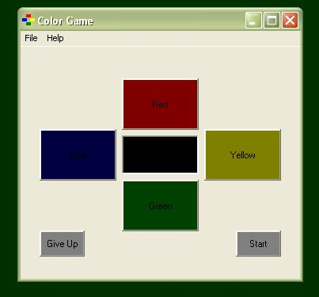



## Color Game \(simular to 'Simon'\)

### Description

This is a simple memory game based on the popular Simon game. The user watches the computer press colored buttons, and then repeats pressing the colored buttons in the same order the computer presses them.
 
### More Info
 
At the start of the game, the player can select how many buttons the computer will press which the player has to repeat. The values can be 1 to 255, the default is 15 if the player clicks on ok.

If you match the sequence of colors the computer plays, you will see a smiley face displayed in the picture box in the center of the game, If you lose a frown is displayed.

             |
---                |---
**Submitted On**   |2003-12-14 19:48:38
**By**             |[Scott Metzgar](https://github.com/Planet-Source-Code/PSCIndex/blob/master/ByAuthor/scott-metzgar.md)
**Level**          |Intermediate
**User Rating**    |4.0 (8 globes from 2 users)
**Compatibility**  |VB 6\.0
**Category**       |[Games](https://github.com/Planet-Source-Code/PSCIndex/blob/master/ByCategory/games__1-38.md)
**World**          |[Visual Basic](https://github.com/Planet-Source-Code/PSCIndex/blob/master/ByWorld/visual-basic.md)
**Archive File**   |[Color\_Game170596282004\.zip](https://github.com/Planet-Source-Code/scott-metzgar-color-game-simular-to-simon__1-51604/archive/master.zip)

